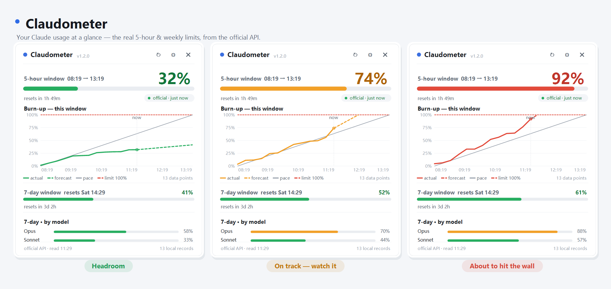

# Claudometer

> **See your Claude limit before you hit it.**

[](../../releases/latest)
[](../../releases)
[](LICENSE)
[](../../stargazers)

A Windows tray app that shows your Claude usage limits — the real 5-hour and weekly numbers,
straight from Anthropic's own usage API. One ~100 KB exe, no runtime to install, no terminal to
keep open — it just lives in your tray and turns amber, then red, before you run out.



*(Named for the `-ometer` instrument family — speed·o·meter, therm·o·meter — Claud·o·meter.)*

## Download

Grab **`Claudometer.exe`** from the [latest release](../../releases/latest) and run it — that's it.
It needs only the .NET Framework 4.x that ships with Windows 10/11. On first run it asks you to log
in to Claude (in your browser), then it lives in your tray.

- **Left click** the tray icon — the panel
- **Right click** — menu (login, refresh, settings, open data folder, quit)

To start it with Windows (autostart + Start-menu shortcut + taskbar pin), clone this repo and run:

```powershell
.\install.ps1
```

`.\install.ps1 -Uninstall` reverses all of it. After that first install it **updates itself** —
it checks GitHub Releases on start and every few hours, and swaps in a newer `Claudometer.exe`
automatically (toggle in Settings, or **Check for updates…** in the menu).

> Requires a Claude subscription (Pro / Max / Team). Unofficial, not affiliated with Anthropic;
> it only calls Anthropic's own endpoints with your account's token.

### macOS (beta)

A native menu-bar port lives on the [`mac`](../../tree/mac) branch. Download **`Claudometer-mac.zip`**
from the [latest macOS release](../../releases) (asset on *Claudometer for macOS*), unzip
`Claudometer.app`, and drag it to Applications. It's unsigned, so the first launch is **right-click →
Open**. It sits in the menu bar (not the Dock); click it → **Show panel**, then sign in.

Same API-only design and burn-up chart as the Windows build. Still beta: English-only, no settings
window or self-update yet. Requires macOS 12+.

---

## Why Claudometer

There are good CLI tools for this (ccusage, Claude-Code-Usage-Monitor). Claudometer's bet is that a
limit you have to *run a command* to see is a limit you'll forget to check — so it lives in the
tray, always one glance away, and changes colour before you run out.

|  | **Claudometer** | CLI usage monitors |
|---|---|---|
| Always visible | ✅ sits in the tray | ❌ run a command each time |
| Numbers | Official usage API — exact % + reset | Often estimated from local token logs |
| Install | One ~100 KB exe, no runtime | Python / Node + dependencies |
| Burn-up chart | ✅ your pace vs the limit, with a forecast | Mostly text |
| Languages | 5 — EN / 中文 / FR / RU / JA | Usually English |
| Updates | Self-updating from Releases | Manual |

No magic — it calls the same endpoint Claude Code's own status line uses. It just makes the number
impossible to miss.

---

## API-only, by design

Everything shown is a number Anthropic returned. The app polls the same endpoint Claude Code's
own status line uses —

```
GET https://api.anthropic.com/api/oauth/usage
→ { five_hour: {utilization, resets_at}, seven_day: {…}, seven_day_opus, seven_day_sonnet }
```

— and displays it. There is **no local estimation, no calibration, and no prediction.** It does
not read your transcripts. The only thing stored on disk is the sequence of readings the API
returned (`%APPDATA%\Claudometer\history.bin`), and that stored history is what the burn-up chart's
line is drawn from — real datapoints, never a guess.

Because the numbers come from the account, **login is required**. With no login the panel shows a
login screen and nothing else.

## Login — once, in your browser

Right-click the tray icon → **Sign in to Claude…** (or `Claudometer.exe --login` in a terminal).
You sign in and consent on the real Anthropic page; the app never sees your password. It receives
an OAuth **token**, stored DPAPI-encrypted for your Windows user only
(`%APPDATA%\Claudometer\token.bin`), sent to no host but Anthropic's own. **Sign out** deletes it.
This is the same OAuth client and flow Claude Code itself uses.

> **Login reliability.** Claudometer identifies itself to Anthropic's OAuth endpoints with its own
> User-Agent, which keeps logins reliable. If you do hit a `429 rate_limit_error`, that's a normal
> rate limit — wait a minute and retry rather than hammering it.

## The burn-up chart

The centerpiece plots utilization across the fixed five-hour window:

- **X** — the whole window, start → reset, so "now" sits where you are in it
- **Y** — percent used, 0 → 100
- **green solid** — the actual readings, connecting the stored API polls up to the latest one
- **green dashed** — a forecast: the recent observed slope extended to the reset (an estimate,
  clearly dashed; capped at 100%)
- **grey line** — the pace line: a constant rate from (start, 0) to (reset, 100%), i.e. "use
  evenly and you'd hit the limit exactly at reset"
- **red dashed** — the 100% ceiling

Below the pace line and clear of the ceiling = headroom to spare. The solid line has points only
from when the app was running and polling — it never fabricates the past; the dashed forecast is
the one estimate, derived from real readings. Colour tracks the level (green / amber / red at your
warn / danger thresholds).

The 5-hour gauge, the 7-day gauge, and the per-model weekly rows (Opus / Sonnet, when the API
returns them) are all the current reading; each shows its real reset countdown.

---

## Appearance & language

Available in **English** (default), 中文, Français, Русский, and 日本語 — switch in Settings; day
names and formatting follow the language. Light theme by default, with a dark option; colour is
centralised in `src/Theme.cs`. Times display in a configured zone (default Singapore, UTC+8),
deliberately not the machine's local time — a usage window is reasoned about against a fixed wall
clock.

## Settings

`%APPDATA%\Claudometer\config.json`, or the ⚙ button.

| Key | Default | Meaning |
|---|---|---|
| `warnPct` / `dangerPct` | 0.70 / 0.90 | Icon colour and balloon thresholds |
| `pollSeconds` | 90 | How often to poll the usage API (min 60, to be gentle) |
| `notify` | true | Threshold balloons |
| `autoUpdate` | true | Self-update from GitHub Releases (checked on start + every 6 h) |
| `timeZoneId` | `Singapore Standard Time` | Display zone |
| `theme` | `light` | `light` or `dark` |
| `language` | `en` | `en` / `zh` / `fr` / `ru` / `ja` |

The OAuth token lives separately in `token.bin` (DPAPI-encrypted); the API readings live in
`history.bin`. Neither is in this file.

---

## Build

Needs nothing but Windows. `build.ps1` calls the .NET Framework compiler already on the machine
(`%WINDIR%\Microsoft.NET\Framework64\v4.0.30319\csc.exe`) — no SDK, no NuGet, no network.

```
src/Theme.cs               centralised light/dark palette + drawing helpers
src/Tz.cs                  display timezone
src/L.cs                   localization (en / zh / fr / ru / ja)
src/JsonPeek.cs            partial JSON reader for API responses
src/OAuth.cs               Claude OAuth (PKCE, unique UA) + DPAPI token storage
src/UsageApi.cs            the api/oauth/usage client
src/History.cs            local store of API readings (the only persisted data)
src/Analytics.cs           builds the snapshot from stored readings
src/AppConfig.cs           settings
src/Fmt.cs                 duration / time formatting
src/IconRenderer.cs        the tray glyph
src/ProjectionRenderer.cs  the burn-up chart
src/PanelForm.cs           the panel
src/SettingsForm.cs        settings dialog
src/LoginForm.cs           the login dialog
src/Updater.cs             self-update from GitHub Releases
src/Report.cs              --login / --api / --update-check / --snapshot / --snapdlg
src/Program.cs             tray, poll loop, alerting
```

CLI: `--login` (browser OAuth), `--api` (print the current usage and record one reading). Debug:
`--show` opens the panel; `--snapshot out.png` renders the panel to PNG; `--snapdlg settings|login
out.png` renders a dialog — how the layout gets checked without depending on which window is on top.

Superseded code (transcript scanning, the output-token metric, /usage calibration) lives under
`attic/` for reference; it is not compiled.
